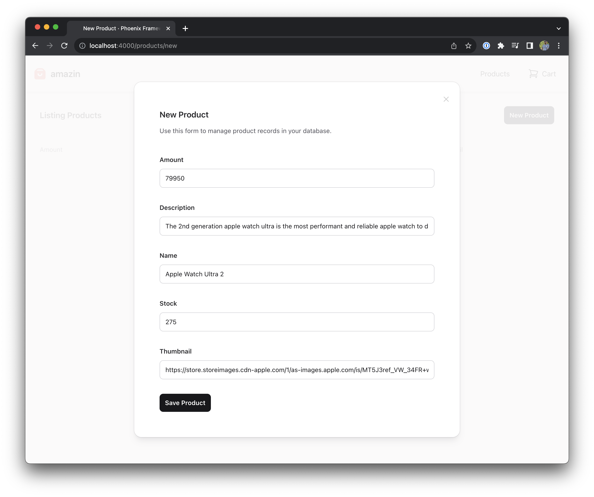
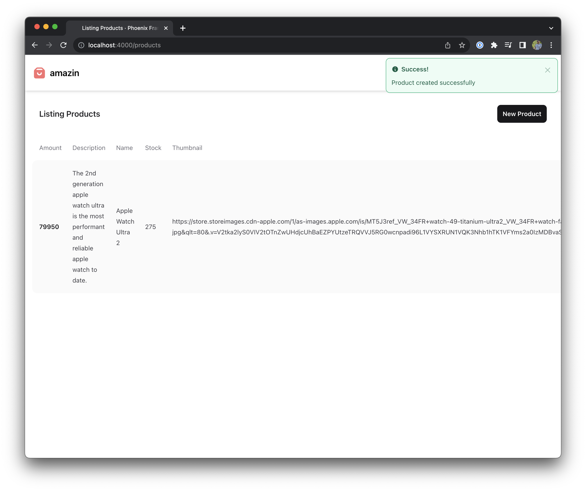
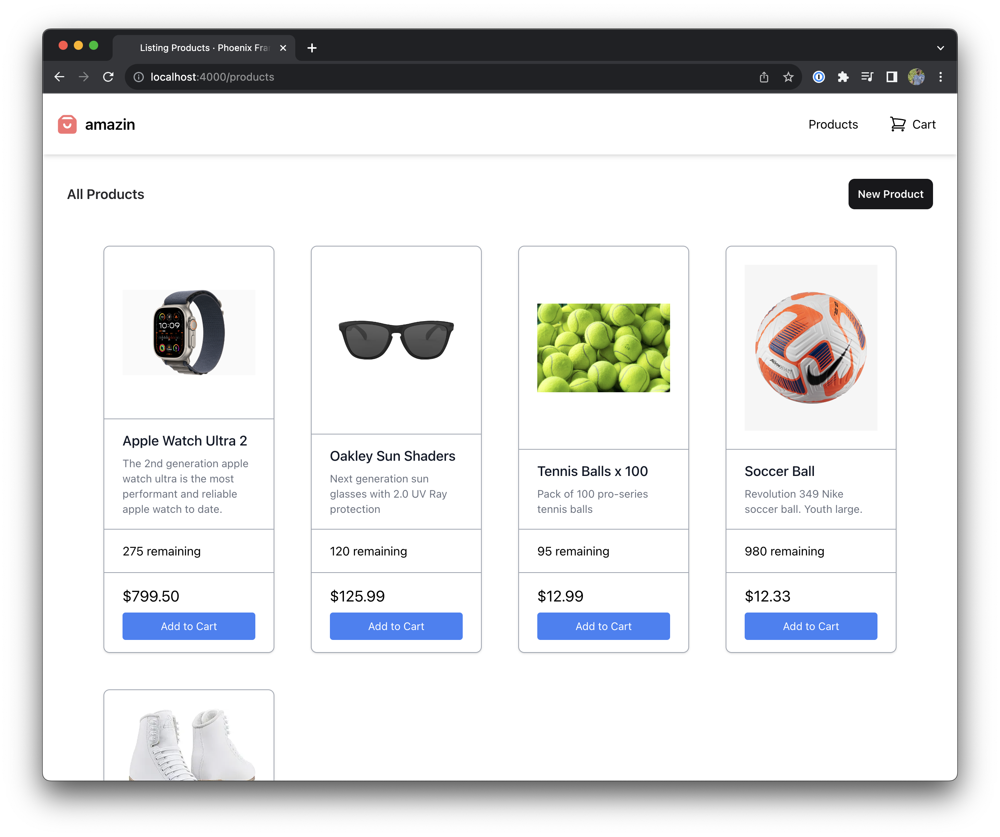

## Products Live View

Now we are going to create a new live view to display our list of products!
If you haven't seen a live-view before, it may blow your mind.

To create our live-view we are going to use Phoenix generators to scaffold the basics of our app.

```bash
mix phx.gen.live Store Product products \
  amount:integer \
  description:text \
  name:string \
  stock:integer \
  thumbnail:text
```

This will create a bunch of files. Feel free to explore them now. Follow the output instructions to add the routes to `lib/amazin_web/router.ex` —

```diff
---
title: lib/amazin_web/router.ex
---

scope "/", AmazinWeb do
  pipe_through :browser

   get "/", PageController, :index

+  live "/products", ProductLive.Index, :index
+  live "/products/new", ProductLive.Index, :new
+  live "/products/:id/edit", ProductLive.Index, :edit

+  live "/products/:id", ProductLive.Show, :show
+  live "/products/:id/show/edit", ProductLive.Show, :edit
end
```

Run migrations —

```bash
mix ecto.migrate
```

Finally, if you start up the server again and go to
[`http://localhost:4000/products`](http://localhost:4000/products),
you should see a bare page with your navbar, list of products, and "new product" button.


Go ahead and add a product with the `New Product` button. Enter product details —



Then save the product —



This isn't the prettiest list. Let's make it better!

Update the markup for the product list page —

```heex
---
title: lib/amazin_web/live/product_live/index.html.heex
---
<.header>
  All Products
  <:actions>
    <.link patch={~p"/products/new"}>
      <.button>New Product</.button>
    </.link>
  </:actions>
</.header>

<div
  class="grid grid-cols-1 sm:grid-cols-2 md:grid-cols-3 lg:grid-cols-4 gap-12 p-12 max-w-7xl mx-auto"
  id="products"
  phx-update="stream">
  <div
    :for={{dom_id, product} <- @streams.products}
    id={dom_id}
    class="flex flex-col bg-white hover:bg-gray-100 cursor-pointer border border-gray-400 shadow rounded-lg"
    phx-click={JS.navigate(~p"/products/#{product}")}
  >
    
    <div class="px-6 py-4 border-t border-gray-400">
      <h3 class="text-lg leading-6 font-medium text-gray-900 pb-2">
        <%= product.name %>
      </h3>
      <p class="text-sm text-gray-500"><%= product.description %></p>
    </div>
    <div class="px-6 py-4 border-t border-gray-400">
      <%= product.stock %> remaining
    </div>
    <div class="p-6 py-4 border-t border-gray-400 text-xl">
      <div class="flex flex-col items-left">
        <%= Money.new(product.amount) %>
        <button
          phx-click="add_to_cart"
          phx-value-id={product.id}
          class="focus:outline-none focus:shadow-outline text-sm bg-blue-500 hover:bg-blue-600 text-white py-2 px-4 mt-2 rounded"
        >
          Add to Cart
        </button>
      </div>
    </div>
  </div>
</div>

<.modal :if={@live_action == :new} id="product-modal" show on_cancel={JS.patch(~p"/products")}>
  <.live_component
    module={AmazinWeb.ProductLive.FormComponent}
    id={:new}
    title={@page_title}
    action={@live_action}
    product={@product}
    patch={~p"/products"}
  />
</.modal>
```

Add a few more products, and your product page is starting to look really nice —



## Reactive UI

We want the live-view to update itself when relevent events occur. Theres alot of ways we _could_ accomplish that; but turns
out phoenix ships with a really nice way out of the box: [Phoenix.PubSub](https://hexdocs.pm/phoenix_pubsub/Phoenix.PubSub.html)!

First we need to make a quick stop in our `Store` context to setup our events. We'll Use `Phoenix.PubSub` to create a reactive UI so that our live-view will auto-update certain domain events occur

```elixir
---
title: lib/amazin/store.ex
---

defmodule Amazin.Store do
  # ... Removed for brevity

  @doc """
  Subscribes you to product events.

  ## Examples

      iex> subscribe_to_product_events()
      :ok

  """
  def subscribe_to_product_events do
    Phoenix.PubSub.subscribe(Amazin.PubSub, "products")
  end

  @doc """
  Broadcast a product event.

  ## Examples

      iex> broadcast_product_event(:product_updated, %Stripe.Product{})
      :ok

  """
  def broadcast_product_event(event, product) do
    Phoenix.PubSub.broadcast(Amazin.PubSub, "products", {event, product})
  end
end
```

Important parts to notice here are the `elixir__Phoenix.PubSub.broadcast/3` call that broadcasts a generic `elixir__:product_updated` event and the `elixir__subscribe_to_product_events/0` function.

Now we want to broadcast events for our view to use. Update the `elixir__Store.create_product/2` and `elixir__Store.update_product/2` functions to broadcast events.

```elixir
---
title: lib/amazin/store.ex
---

defmodule Amazin.Store do
  # ... Removed for brevity

  @doc """
  Creates a product.

  ## Examples

      iex> create_product(%{field: value})
      {:ok, %Product{}}

      iex> create_product(%{field: bad_value})
      {:error, %Ecto.Changeset{}}

  """
  def create_product(attrs \\ %{}) do
    result =
      %Product{}
      |> Product.changeset(attrs)
      |> Repo.insert()

    case result do
      {:ok, new_product} ->
        broadcast_product_event(:product_created, new_product)
        {:ok, new_product}

      error ->
        error
    end
  end

  @doc """
  Updates a product.

  ## Examples

      iex> update_product(product, %{field: new_value})
      {:ok, %Product{}}

      iex> update_product(product, %{field: bad_value})
      {:error, %Ecto.Changeset{}}

  """
  def update_product(%Product{} = product, attrs) do
    result =
      product
      |> Product.changeset(attrs)
      |> Repo.update()

    case result do
      {:ok, updated_product} ->
        broadcast_product_event(:product_updated, updated_product)
        {:ok, updated_product}

      error ->
        error
    end
  end

  # ... Removed for brevity
end
```

When our live-view mounts we want to subscribe our view to any product events. If we get notified of
any events via `elixir__Pheonix.PubSub.broadcast/2`, the `elixir__handle_info/2` function in the module is called.

Lets replace our `mount` function and add `handle_info` functions to our product grid live view —

```elixir
---
title: lib/amazin_web/live/product_live/index.ex
---
defmodule AmazinWeb.ProductLive.Index do
  # ... Removed for brevity

  @impl true
  def mount(_params, _session, socket) do
    if connected?(socket), do: Store.subscribe_to_product_events()

    {:ok, stream(socket, :products, Store.list_products())}
  end

  @impl true
  def handle_info({:product_updated, updated_product}, socket) do
    {:noreply, stream_insert(socket, :products, updated_product)}
  end

  @impl true
  def handle_info({:product_created, created_product}, socket) do
    {:noreply, stream_insert(socket, :products, created_product)}
  end

  # ... Removed for brevity
end
```

It's worth reading the [docs](https://hexdocs.pm/phoenix_live_view/Phoenix.LiveView.html#stream_insert/4) to understand `stream_insert/4`. It's doing some powerful things and letting us write less, more delcaritive, code.

Now that everything is wired up to be reactive, you can see the reactivity in action! Open up a two browser window's side by side of the app. In one window create a new product and you'll see it magically appear in the other browser window! Edit a product to see the same effect ✨
